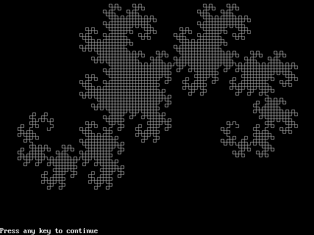
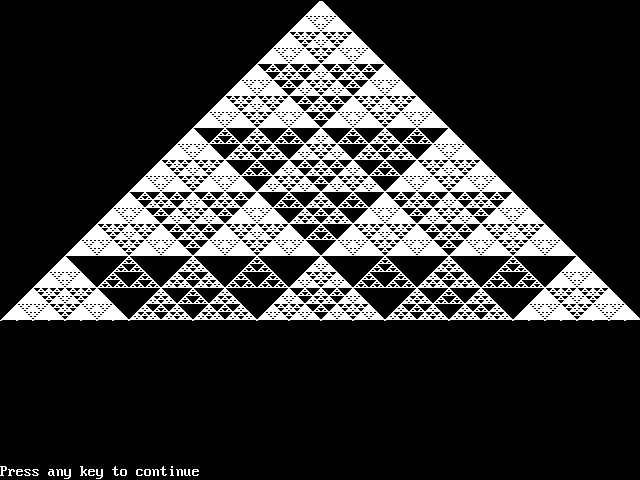
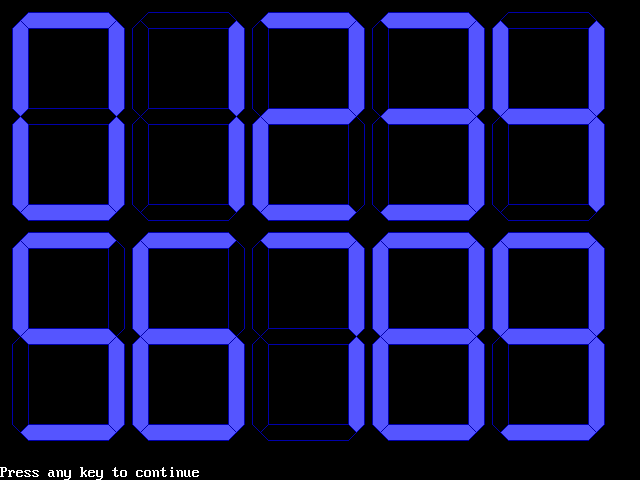
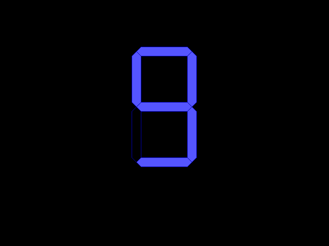
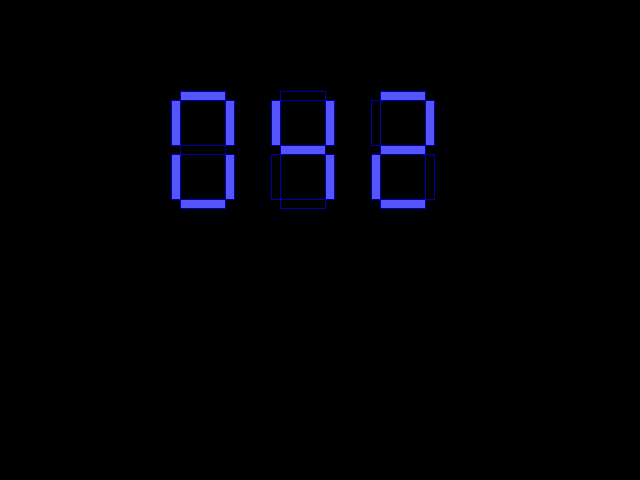
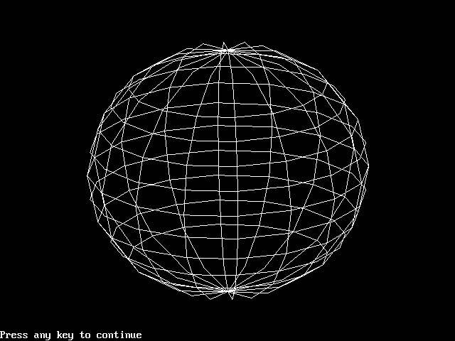
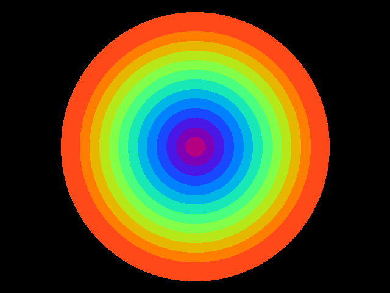
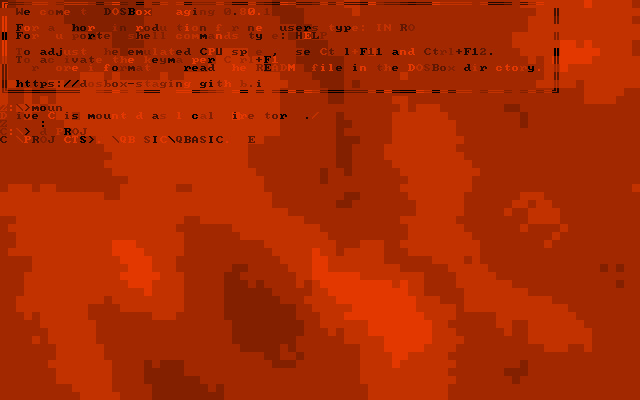

# QBasic Programs Archive

This is a collections of various simple programs written for PC Basic. Topics include: palette cycling, fast animations, fractals&iterative models and more.

Many of this were featured as code-golf on [@PCBasicBot](https://twitter.com/PCBasicBot) and [@BBCBasicBot](https://twitter.com/BBCBasicBot) pages.

## Requirements

* QBasic 1.1
* QuickBasic 4.5 or later

## Contents

* [Animated Gears](#animated-gears)
* [Mazes](#mazes)
* [Iterative systems](#iterative-systems)
* [Text-mode fractals](#text-mode-fractals)
* [Parametric curves](#parametric-curves)
* [Flower curves](#flower-curves)
* [Plane fractals](#plane-fractals)
* [Sierpinski cellular automatons](#sierpinski-cellular-automatons)
* [Segmented digit display](#segmented-digit-display)
* [3D objects](#3d-objects)
* [3D surfaces](#3d-surfaces)
* [Many colors](#many-colors)
* [Scattering simulations](#scattering-simulations)
* [Miscellaneous](#miscellaneous)

## Animated Gears

In this section each frame of animated gears is rendered and cycled with `SCREEN` command.

**[GEARS1.BAS](GEARS1.BAS)** - Single rotating gear.

**[GEARS2.BAS](GEARS2.BAS)** - A pair of rotating gears' outlines.

**[GEARS3.BAS](GEARS3.BAS)** - A pair of filled rotating gears.

**[GEARS4.BAS](GEARS4.BAS)** - Three filled gears.

**[GEARS5.BAS](GEARS5.BAS)** - Three multicolored gears (an imitation of **GLGears**).

**[GEARS6.BAS](GEARS6.BAS)** - A quartet of interconnected gears.

## Mazes

This section contains imitations of **10 PRINT CHR$(205.5+RND(1)); : GOTO 10** maze for PC Basic.

**[MAZE1.BAS](MAZE1.BAS)** - A straighforward port of C64 program. Doesn't look like a connected maze bacause symbols look differently on PC.

**[MAZE2.BAS](MAZE2.BAS)** - A more closer imitation of the maze, but in graphical format using `GET` and `PUT` to create and render diagonal lines as sprites.

**[MAZE3.BAS](MAZE3.BAS)** - A different type of maze with slightly different sprites.

**[MAZE4.BAS](MAZE4.BAS)** - And another maze, this time with 3 sprites.

**[MAZE5.BAS](MAZE5.BAS)** - The second version of 3-sprite maze.

**[MAZE6.BAS](MAZE6.BAS)** - Same as above, but sprites are created as hexademical array with `DATA` instead of manual `LINE` drawing.

## Iterative systems

Images created with a system of iterative equations.

**[FERN.BAS](FERN.BAS)** - The Barnsley fern.

**[LORENZ.BAS](LORENZ.BAS)** - Animated Lorenz attractor.

**[LORENZ2.BAS](LORENZ2.BAS)** - Another animated Lorenz attractor with different shading.

**[CHAOS1.BAS](CHAOS1.BAS)** - The classic logistic map of <b>Xn+1=R&nbsp;Xn(1-Xn)</b>. Each value of **R** receives 200 iterations.

**[CHAOS2.BAS](CHAOS2.BAS)** - Same as above, but with 50 iterations for each value of **R**.

**[VORONOI.BAS](VORONOI.BAS)** - Voronoi tessellation of a plane.

## Text-mode fractals

Julia and Mandelbrot sets in ASCII text mode.

**[TXTJULIA.BAS](TXTJULIA.BAS)** - Text-based Julia set in ASCII-symbol graphics.

**[TXTJLIA2.BAS](TXTJLIA2.BAS)** - Text-based Julia set with colored characters.

**[TXTMNDL.BAS](TXTMNDL.BAS)** - Text-based Mandelbrot set with colored characters.

## Parametric curves

**[LSSJOUS1.BAS](LSSJOUS1.BAS)** - A collection of Lissajous curves with various **a** and **b** parameters.

**[LSSJOUS2.BAS](LSSJOUS2.BAS)** - Several Lissajous curves animated with `SCREEN`.

**[ROSE1.BAS](ROSE1.BAS)** - A parametris rose curve with filled segments.

**[ROSE2.BAS](ROSE2.BAS)** - Same as above, but with different palette.

**[ROSE3.BAS](ROSE3.BAS)** - Another shading method for the curve.

**[ROSE5.BAS](ROSE5.BAS)** - A different type of rose curve.

## Flower curves

This section also contains parametric curves, but drawn as 'flowers' with different filling techniques.

**[FLOWER1.BAS](FLOWER1.BAS)**

**[FLOWER2.BAS](FLOWER2.BAS)**

**[FLOWER3.BAS](FLOWER3.BAS)**

**[FLOWER4.BAS](FLOWER4.BAS)**

**[FLOWER5.BAS](FLOWER5.BAS)**

## Plane fractals

**[PEANO.BAS](PEANO.BAS)** - The Peano curve.

**[DRAGON.BAS](DRAGON.BAS)** - The Heighway dragon.

## Sierpinski cellular automatons

Creating Sierpinski patterns with line-by-line cellular automatons based on division modulus of a Pascal's triangle numbers.

**[SIERPIN1.BAS](SIERPIN1.BAS)** - A classic Sierpinski cellular automaton.

**[SIERPIN2.BAS](SIERPIN2.BAS)** - Same as above, but centered on the screen.

**[SIERPIN3.BAS](SIERPIN3.BAS)** - A pattern using bitwise `AND 15` operation instead of `MOD 2`.

## Segmented digit display

Programs that draw segmented digits.

**[DIGITS1.BAS](DIGITS1.BAS)** - Draw all digits from 0 to 9 in with 7 segments.

**[DIGITS2.BAS](DIGITS2.BAS)** - Same as above, but more slim with 6 pixel withs instead of 8.

**[DIGITS3.BAS](DIGITS3.BAS)** - Single-digit counter.

**[DIGITS4.BAS](DIGITS4.BAS)** - Three-digit counter with simpler shapes.

**[DIGITS5.BAS](DIGITS5.BAS)** - Hex counter with two digits.

## 3D objects

Wireframes for 3D objects.

**[SPHERE3D.BAS](SPHERE3D.BAS)** - Sphere 3D wireframe.

**[TORUS3D.BAS](TORUS3D.BAS)** - Torus 3D wireframe.

**[TORUS3D2.BAS](TORUS3D2.BAS)** - Animated torus 3D wireframe.

## 3D surfaces

Plotting 3D surfaces.

**[SURF3D.BAS](SURF3D.BAS)** - "Wave" 3D plot.

**[DROP3D.BAS](DROP3D.BAS)** - The plot above animated with palette cycling.

**[SURF3D2.BAS](SURF3D2.BAS)** - A different type of plot.

**[SPIRAL3D.BAS](SPIRAL3D.BAS)** - 3D plot of double spiral.

## Many colors

Demos that mean to display as many colors as possible in VGA modes provided by QBasic

**[SPLAT1.BAS](SPLAT1.BAS)** - Color 'splats'.

**[SPLAT2.BAS](SPLAT2.BAS)** - A similar algorithm as above.

**[SUN.BAS](SUN.BAS)** - Cocentric circles with palette cycling.

**[RAINBOW.BAS](RAINBOW.BAS)** - Palette cycling of sectors.

**[PALETTE.BAS](PALETTE.BAS)** - Fullscreen color cycle over all possible colors in `SCREEN 12`.

## Scattering simulations

Simulations of particle scattering with RNG.

**[SCATTER1.BAS](SCATTER1.BAS)** - Simple scattering from a hole.

**[SCATTER2.BAS](SCATTER2.BAS)** - Same as above but with different parameters.

**[DIFRACT1.BAS](DIFRACT1.BAS)** - Single-slit difraction simulation.

**[DIFRACT2.BAS](DIFRACT2.BAS)** - Same as above but mostly integer-based and therefore faster.

**[SPIRAL1.BAS](SPIRAL1.BAS)** - 4-ray spiral.

**[SPIRAL2.BAS](SPIRAL2.BAS)** - Same as above but more optimized.

**[SPIRAL3.BAS](SPIRAL3.BAS)** - 8-ray spiral.

## Miscellaneous

**[BURN.BAS](BURN.BAS)** - ["Burning"](https://www.pouet.net/prod.php?which=88237) demo from [pouet.net](https://www.pouet.net/). `CALL` runs x86 bytecode encoded as string characters.

**[FIBSPRL.BAS](FIBSPRL.BAS)** - Fibonacci spiral with different color for each individual spiral.

**[TXTMOIRE.BAS](TXTMOIRE.BAS)** - Moiré pattern in text mode.

**[TXTDROP.BAS](TXTDROP.BAS)** - Text mode water circles animated with with palette cycling.

**[YINYANG.BAS](YINYANG.BAS)** - Rotating Yin-Yang symbol.

**[WIN95.BAS](WIN95.BAS)** - Win95 logo.

